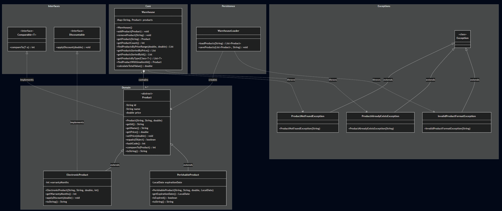
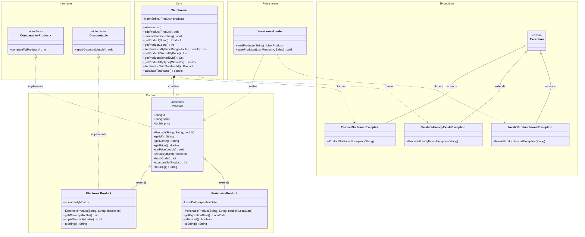

## Zadanie 7 – Pokročilá správa skladu (10 bodov)

## O čom je toto zadanie

V tomto zadaní pracuješ so **skladovým systémom** pre dva typy produktov – elektroniku a kaziteľný tovar. Máš hotovú základnú kostru tried z predchádzajúceho zadania a tvojou úlohou je ju rozšíriť o **reálne používané koncepty z praxe**.

### Čo budeš robiť

| # | Úloha | Kľúčový koncept |
|---|---|---|
| 1 | Upraviť `Product` — pridať porovnávanie a validáciu vstupu | `Comparable<T>`, `IllegalArgumentException` |
| 2 | Doplniť `PerishableProduct` o kontrolu expirovanosti | `LocalDate`, metóda `isExpired()` |
| 3 | Prepracovať `Warehouse` na `Map` a pridať pokročilé metódy | `HashMap`, generická metóda, `Stream API` |
| 4 | Napísať `WarehouseLoader` na čítanie/zápis CSV súboru | `BufferedReader`, `PrintWriter`, `try-with-resources` |
| 5 | Vytvoriť vlastnú kontrolovanú výnimku `InvalidProductFormatException` | checked `Exception` |


> [!WARNING]
> **Dôležité upozornenie pre hodnotenie:**
> Dodržuj presné názvy tried, metód a atribútov podľa tohto zadania a diagramu. Akékoľvek preklepy spôsobia zlyhanie automatických testov! Atribúty musia byť vždy `private`.

---

## Čo zostáva z predchádzajúceho zadania

Zo Zadania 6 **prenášaš** nasledujúce triedy (s prípadnými úpravami):

| Trieda / Rozhranie | Stav | Zmeny |
|---|---|---|
| `Product` | Modifikovaná | `implements Comparable<Product>`, `compareTo()`, **validácia zápornej ceny** |
| `ElectronicProduct` | Prenášaná | Implementuje `Discountable` (ako predtým) |
| `PerishableProduct` | Modifikovaná | `expirationDate: LocalDate` namiesto `int`, nová metóda `isExpired()` |
| `Discountable` | Prenášaná | Bez zmien |
| `ProductNotFoundException` | Prenášaná | Bez zmien |
| `ProductAlreadyExistsException` | Prenášaná | Bez zmien |
| `Warehouse` | Výrazne zmenená | Prechod z `Set` na `Map` + nové metódy vrátane generickej `getProductsByType()` |

## Čo je nové v tomto zadaní

| Trieda | Popis |
|---|---|
| `WarehouseLoader` | Načítanie/ukladanie produktov zo súboru (CSV) s `try-with-resources` |
| `InvalidProductFormatException` | Nová checked výnimka pre chyby formátu pri čítaní súboru |

---


> [!NOTE]
> **Poznámka k prístupu ku kolekciám:**
> Niektoré metódy v `Warehouse` (napr. `findProductsByPriceRange`, `calculateTotalValue`, `getProductsByType`) je možné implementovať pomocou klasického `for` cyklu.
> **Môžte však použiť moderné Stream API**, ktoré je stručnejšie a lepšie čitateľné — testy overujú len správnosť výsledku.
>
> Príklad transformácie z klasického `for` cyklu na Stream API:
> ```java
> // Namiesto klasického prístupu:
> // double total = 0;
> // for (Product p : products.values()) {
> //     total += p.getPrice();
> // }
> // return total;
> 
> // Použite Stream API:
> return products.values().stream().mapToDouble(Product::getPrice).sum();
> ```

---


## Diagram tried (Class Diagram)



---

## Úlohy na implementáciu

### 1. Úprava triedy `Product` (z predchádzajúceho zadania)

- Trieda musí implementovať rozhranie `Comparable<Product>`.
- Pridaj metódu `compareTo(Product o)`, ktorá porovnáva produkty podľa `id` (abecedne).
- Konštruktor musí validovať cenu – ak nie je kladná, vyhodí `IllegalArgumentException`.


### 2. Úprava triedy `PerishableProduct`

- Namiesto starého atribútu `expirationDays: int` použi `expirationDate: LocalDate`.
- Konštruktor sa zmení na `PerishableProduct(String id, String name, double price, LocalDate expirationDate)`.
- Getter: `getExpirationDate()` vráti hodnotu typu `LocalDate`.
- Pridaj metódu `isExpired()` ktorá vráti `true` ak je `expirationDate` pred dnešným dátumom.


### 3. Sklad `Warehouse` 
#### Prechod na `Map`
Sklad teraz nepoužíva atribút `Set<Product>`, ale `Map<String, Product>`, kde **kľúč je ID produktu**:


#### **Požadované metódy:**

| Metóda | Popis                                                                                        |
|---|----------------------------------------------------------------------------------------------|
| `addProduct(Product p)` | Ak ID už existuje → `throws ProductAlreadyExistsException`                                   |
| `removeProduct(String id)` | Ak ID neexistuje → `throws ProductNotFoundException`                                         |
| `getProduct(String id)` | Vráti produkt alebo `null`                                                                   |
| `getProductCount()` | Počet produktov v sklade                                                                     |
| `findProductsByPriceRange(double min, double max)` | Vráti `List<Product>` s cenou v rozsahu `[min, max]`                                         |
| `getProductsSortedByPrice()` | Vráti `List<Product>` zoradený vzostupne podľa ceny (odporúča sa použiť `Comparator`) |
| `getProductsSortedById()` | Vráti `List<Product>` zoradený podľa `compareTo()` — teda podľa ID abecedne                  |
| `getProductsByType(Class<T> type)` | Generická metóda – vráti len produkty daného typu (napr. `ElectronicProduct.class`)          |
| `findProductWithSmallestId()` | Vráti produkt s abecedne najmenším ID — používa `compareTo()` priamo v `for` cykle           |
| `calculateTotalValue()` | Súčet cien všetkých produktov v sklade                                                       |

**Príklad použitia generickej metódy:**
```java


**Poznámka ku getProductsByType(Class<T> type)**
Inštancie triedy Class<T> nesú informácie o dátových typoch (trieda/rozhranie). Takúto inštanciu môžme získať pridaním .class za názov triedy napr. ElectronicProduct.class alebo zavolaním metódy getClass() nad inštanciou napr. tv.getClass(), kde tv je inštancia.
Ak nad ľubovolnou inštanciou tej istej triedy zavoláme metódu getClass, tieto volania vrátia ten istý objekt typu Class<T>.

List<ElectronicProduct> electronics = warehouse.getProductsByType(ElectronicProduct.class);
List<PerishableProduct> perishables = warehouse.getProductsByType(PerishableProduct.class);


```

### 4. Súborová perzistencia: `WarehouseLoader`

Trieda `WarehouseLoader` zabezpečuje ukladanie a načítanie produktov do/z CSV súborov.

**Formát CSV súboru:**
```
TYP,ID,NAZOV,CENA,EXTRA
```

| Typ | Extra | Príklad |
|---|---|---|
| `E` (Electronic) | warrantyMonths (int) | `E,E01,TV Samsung,500.0,24` |
| `P` (Perishable) | expirationDate (YYYY-MM-DD) | `P,P01,Jablko,0.5,2025-06-15` |

**Požadované metódy:**

```java
// Načíta produkty zo súboru. Ak súbor nemá správny formát, vyhodí výnimku.
// Vrátený zoznam je zoradený podľa ID (používa Collections.sort → compareTo).
public List<Product> loadProducts(String filename) throws InvalidProductFormatException

// Uloží produkty do súboru vo formáte CSV
public void saveProducts(List<Product> products, String filename)
```

> [!IMPORTANT]
> Obe metódy musia používať konštrukciu `try-with-resources` pre automatické zatvorenie zdrojov!

**Príklad implementácie:**
```java
try (BufferedReader reader = new BufferedReader(new FileReader(filename))) {
    String line;
    while ((line = reader.readLine()) != null) {
        // parsovanie riadku ...
    }
} catch (IOException e) {
    // spracovanie IO chyby
}
```

### 5. Vlastná výnimka: `InvalidProductFormatException`

- Kontrolovaná (checked) výnimka, dedí od `Exception`.
- Používa sa v `WarehouseLoader.loadProducts()`, keď riadok v súbore typu CSV nemá správny počet stĺpcov alebo obsahuje neplatné hodnoty.

---

## Štruktúra projektu

```text
zadanie7/
├── src/
│   └── oop/
│       └── zadanie7/
│           ├── Discountable.java
│           ├── ElectronicProduct.java
│           ├── PerishableProduct.java
│           ├── Product.java
│           ├── ProductAlreadyExistsException.java
│           ├── ProductNotFoundException.java
│           ├── InvalidProductFormatException.java
│           ├── Warehouse.java
│           └── WarehouseLoader.java
├── test/
│   └── oop/
│       └── zadanie7/
│           ├── StudentInventoryTest.java
│           └── TeacherEvaluationTest.java
├── mermaid_zad7.png
├── README.md
└── zadanie7.iml
```

---

### Spustenie testov

**Cez IntelliJ IDEA:**
1. Otvor projekt cez **File → Open** a vyber priečinok `zadanie2java`.
2. Klikni pravým tlačidlom na priečinok `test` → **Run 'All Tests'**.
3. Alebo otvor konkrétny test → klikni na zelenú šípku.

**Cez Maven (príkazový riadok):**
```bash
mvn clean test
```

---
